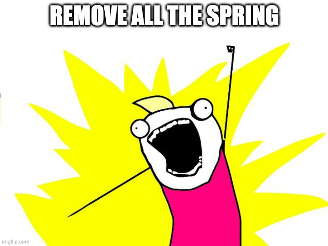

# Less popular Spring functions

## 1-less-vendor-locking

* Most classes are Spring-agnostic already
* Just `@Configuration` and `@RestController` left

* Using JAX-RS and javax `@Inject`
* `spring-boot-starter-jersey` over `spring-boot-starter-web`
* `@Configuration` as the only Spring-aware class
* Definitely not a must, but worth knowing :)

### Profit?

* Smooth switch between frameworks if needed
* Quarkus, Jakarta implementations, Micronaut with some add-ons 
