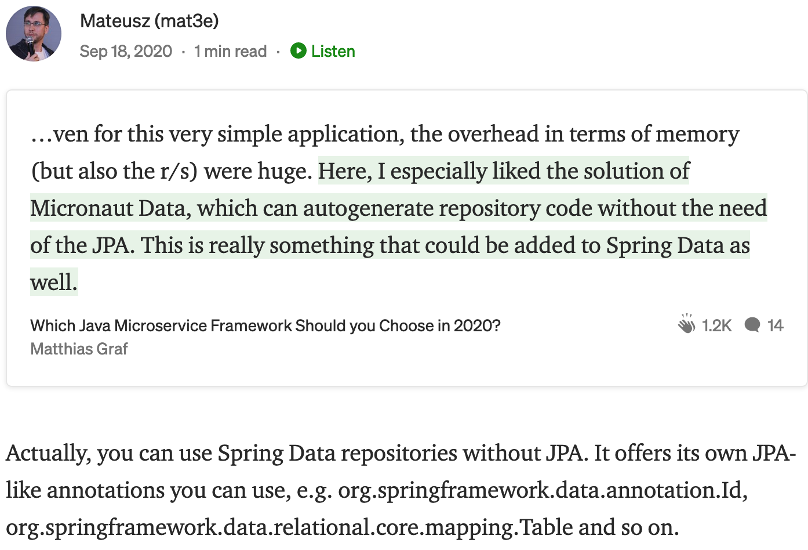

# Less popular Spring functions

## 3-data-jdbc

Do you know we don't need Hibernate to use `@Table` annotation?

[](https://betterprogramming.pub/which-java-microservice-framework-should-you-choose-in-2020-4e306a478e58)

### [Spring Data JDBC](https://spring.io/projects/spring-data-jdbc)

[Detailed documentation](https://docs.spring.io/spring-data/jdbc/docs/current/reference/html/#reference).

* Support for all the repositories, up to `PagingAndSortingRepository`
* `@Query` with parameters, etc. (pure SQL, not HQL/JPQL)
* You can also have dummy entities, just for repo and querying
   ```java
   interface CardRepository extends Repository<DummyForRepo, Integer> {
     @Query("""
            SELECT c.number, p.name, p.surname, c.remainingDebt"
              FROM cards c, customer p WHERE c.number = :num
              AND c.personId = p.personId AND p.personId = :id
            """)
     Optional<Card> findActive(@Param("id") int id, @Param("num") String number);
   }
   
   @Table(name = "card_infos")
   class DummyForRepo {
     @Id
     private int id;
   }
   ```

## And what if I already have JPA?

You might consider using `orm.xml` for mapping. It was introduced quite recently and can help separate your domain code
from DB mappings.

Example:
```xml
<?xml version="1.0" encoding="UTF-8" ?>
<entity-mappings xmlns="http://java.sun.com/xml/ns/persistence/orm"
                 xmlns:xsi="http://www.w3.org/2001/XMLSchema-instance"
                 xsi:schemaLocation="http://java.sun.com/xml/ns/persistence/orm
   http://java.sun.com/xml/ns/persistence/orm_1_0.xsd"
                 version="1.0">

    <description>XML Mapping file</description>

    <entity class="io.github.mat3e.task.TaskSnapshot" access="FIELD">
        <table name="tasks"/>
        <attributes>
            <id name="id">
                <generated-value strategy="IDENTITY"/>
            </id>
            <basic name="description">
                <column nullable="false"/>
            </basic>
            <basic name="done">
                <column nullable="false"/>
            </basic>
            <basic name="deadline"/>
            <basic name="changesCount">
                <column nullable="false"/>
            </basic>
            <basic name="additionalComment"/>
            <embedded name="sourceId">
                <attribute-override name="id">
                    <column name="source_id"/>
                </attribute-override>
            </embedded>
        </attributes>
    </entity>

    <!-- ... -->
```
